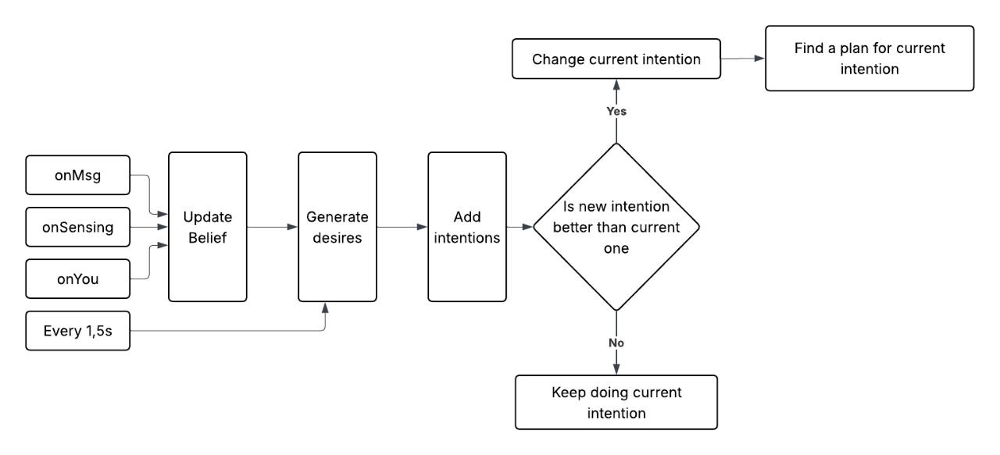
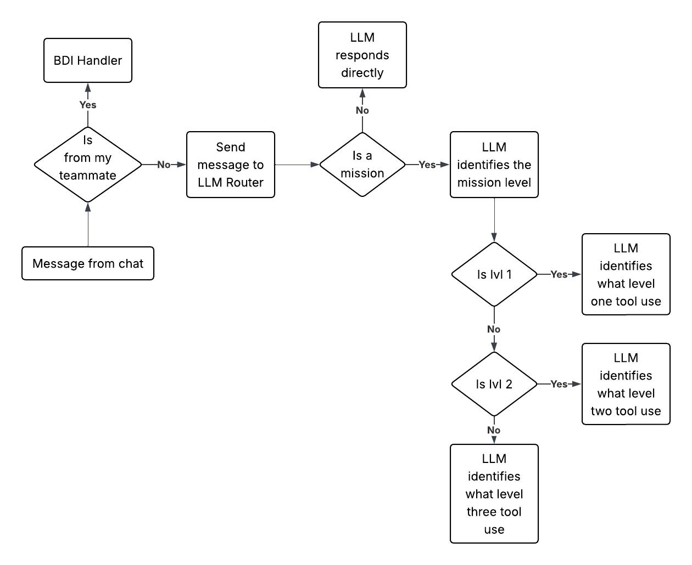

# 1. Introduction
The objective of this project is the development of a pair of cooperative autonomous agents able to operate in the Deliveroo environment. The agents must maximize the obtained reward by collecting and delivering parcels while adapting to dynamic missions introduced during the game.

The proposed solution combines three paradigms:
- Belief-Desire-Intention (BDI) architecture for reactive decision making.
- Large Language Models (LLMs) for mission interpretation.
- PDDL planning for complex coordination tasks.

This combination allows agents to reason efficiently in dynamic environments while remaining flexible enough to interpret previously unseen mission descriptions.

---

# 2. BDI

The core decision-making component of the system is implemented using a Belief-Desire-Intention (BDI) architecture. The agent continuously operates through a reasoning cycle that transforms perceptual input into structured beliefs, evaluates possible objectives, and selects the most suitable intention for execution.


---

## 2.1 Belief

The belief base represents the agent’s internal model of the environment. It is continuously updated through perception events and communication messages.

It contains:
- the agent’s current position;
- others agent's position;
- visible parcels and their properties (location, reward, carrier);
- crates position;
- map structure;
- active missions and constraints;
- configuration parameters (capacity, reward statistics, decay rules);
- coordination state (e.g., waiting, meeting points, synchronization flags).

The belief base is therefore not a static snapshot of the world, but a dynamic and continuously evolving representation that integrates both external perception and internal reasoning outputs.

---

## 2.2 Desire Generation

At each reasoning cycle, the system generates a set of competing **desires**, each representing a potential objective the agent could pursue.

Desires are not executable actions, but abstract goals evaluated through a utility function.

The main categories of desires include:
- **Pickup Desires**: generated for reachable parcels;
- **Delivery Desires**: generated when the agent is carrying parcels;
- **Mission Desires**: derived from active non persistent mission objectives;
- **Exploration Desires**: generated to search for new parcels;
- **Coordination Desires**: activated when cooperation with the teammate is required.

Each desire is associated with a numerical priority score computed from multiple factors, including:
- expected reward;
- distance cost;
- carrying capacity constraints;
- active mission modifiers (e.g., multipliers or bonus).

This mechanism allows all possible actions to be compared on a unified numerical scale.

---

## 2.3 Priority-Based Selection

Once generated, all desires compete through a priority-based evaluation function.

The system does not rely on fixed rules (e.g., always deliver before pickup), but instead selects the desire with the highest computed utility.

Mission-related desires can significantly alter this ranking through reward modifiers or structural constraints, ensuring that temporary or high-impact objectives are prioritized over standard behaviors.

This approach results in a dynamic decision-making process where the agent’s behavior emerges from the interaction between environment state, missions, and utility evaluation.

---

## 2.4 Intention Management and Revision

The intention layer represents the currently selected objective that the agent is actively pursuing.

At each reasoning cycle, intentions are **revised** based on the newly generated set of desires.

The revision process follows a simple principle:
1. Generate all current desires.
2. Compute their priority scores.
3. Identify the desire with the highest utility.
4. Compare it with the currently active intention.
5. Replace the intention if a higher-priority desire is found.

This continuous revision mechanism ensures that the agent remains adaptive to changes in the environment, such as:
- appearance of high-value parcels;
- changes in mission constraints;
- movement of agents or obstacles;

---

## 2.5 Execution Layer (Plans)

Intentions are not executed directly. Instead, each intention is mapped to a corresponding plan in the plan library.

Each plan defines:
- applicability conditions;
- execution steps;

The available plans include:
- Pickup Plan;
- Delivery Plan;
- Mission Execution Plan;
- Exploration Plan;
- Coordination Plan.

This separation between intentions and execution ensures modularity: the decision-making layer remains independent from low-level action implementation.

---

## 2.6 Continuous Reasoning Cycle

The BDI system operates in a continuous loop triggered by:
- perception events (sensing updates);
- communication messages from the teammate;
- periodic watchdog activation when no events are received.

This ensures that the agent continuously re-evaluates its beliefs, desires, and intentions, maintaining responsiveness even in the absence of new external inputs.

---

# 3. LLM

A key aspect of the system is the ability to interpret heterogeneous natural language inputs and convert them into structured internal representations. To achieve this, the architecture is designed as a layered cognitive pipeline that separates **intent recognition**, **mission classification**, and **tool selection**. This modular design allows the system to handle both actionable instructions and informational queries in a unified but structured manner.


---

## 3.1 Router: Intent Detection

The first stage of the pipeline is responsible for distinguishing between different types of input messages. Not all incoming messages correspond to executable tasks; some require reasoning or information retrieval rather than action execution.

The router classifies each input into one of two main categories:

- **Mission**: an instruction that must be translated into an executable goal for the agent.  
- **Cognitive Query**: a question or request for information that does not directly result in an action.

This separation is fundamental, as it prevents the agent from incorrectly treating non-actionable messages as executable tasks.

The output of this stage is a structured intent representation:

```json
{
  "type": "TOOL_MISSION" | "COGNITIVE_MISSION"
}
```

This abstraction enables the system to maintain a clear distinction between decision-making and reasoning support.

---

## 3.2 Mission Classification

Once an input is identified as a mission, it is further classified according to its complexity. Missions are divided into three levels:

### 3.2.1 Classifier

After an input has been identified as a mission, a second LLM-based component is responsible for determining the mission level. The objective of this classifier is to map a natural language description into one of the three mission categories: Atomic, Persistent, or Cooperative.

Rather than relying on manually defined rules or keyword matching, the classifier performs a semantic analysis of the mission and identifies the underlying objective and its impact on the agent's behavior.

The classification criteria are based on the following principles:

- **Level 1 (Atomic)**: the mission can be completed through a single objective executed by one agent and does not modify future decision-making.
- **Level 2 (Persistent)**: the mission introduces rules, constraints, bonuses, or penalties that affect future actions throughout the game.
- **Level 3 (Cooperative)**: the mission explicitly requires interaction, synchronization, or dependency between multiple agents.

The classifier produces a structured output:

```json
{
  "type": "TYPE_1 | TYPE_2 | TYPE_3",
}
```


### 3.2.2 Level Interpretation

Although missions are categorized into three levels (Atomic, Persistent, and Cooperative), the underlying processing architecture remains uniform across all cases. Each mission, regardless of its level, follows the same pipeline: it is interpreted by a dedicated LLM-based subsystem, converted into a structured JSON representation, and then transformed into a `Mission` object that is integrated into the BDI belief base.

In particular, each mission level is associated with a dedicated subsystem:
- **Level 1 subsystem** handles atomic missions and focuses on extracting direct executable actions such as movement or interaction with map elements.
- **Level 2 subsystem** processes persistent missions and interprets them as modifications to the reward structure or decision-making utility function.
- **Level 3 subsystem** handles cooperative missions and extracts coordination requirements between multiple agents.

Each subsystem uses a different prompt configuration and a different interpretation schema, tailored to the semantic nature of the mission level. However, the core architectural pipeline remains unchanged:
1. Input mission is received and routed to the appropriate subsystem.
2. The LLM generates a structured JSON representation according to the level-specific prompt.
3. The JSON output is parsed into a unified `Mission` object.
4. The mission is inserted into the belief base.
5. The BDI cycle incorporates the mission into desire generation and intention revision.

---

## 3.4 Cognitive Queries

Not all inputs received by the system correspond to missions that require execution. Some messages are instead general-purpose questions that do not relate to the Deliveroo environment or to the agent's objectives. These inputs are classified as **Cognitive Queries**.

Unlike mission-related requests, cognitive queries do not generate intentions, plans, or actions. Their purpose is to allow the system to retain the standard reasoning capabilities of a Large Language Model while keeping them separated from the agent's decision-making process.

Examples include:
- "Calculate ($6 \times 9 + 1$)"
- "What is the capital of Italy?"

Once a query is identified by the router, it bypasses the mission classification pipeline and is directly processed by the LLM reasoning layer.

The LLM analyzes the request and generates a textual response without interacting with the BDI architecture. Consequently, no beliefs, desires, intentions, or plans are created as a result of processing a cognitive query.

---

## 3.5 Design Rationale and Advantages

The proposed cognitive architecture provides several key advantages.

First, it introduces a clear separation between understanding and execution. The LLM is responsible for interpreting natural language inputs and transforming them into structured representations, while decision-making and action execution remain within the BDI framework.

Second, the level-based mission decomposition allows the system to uniformly handle heterogeneous tasks, ranging from simple navigation objectives to persistent reward modifiers and cooperative behaviors.

Third, the tool selection mechanism ensures modularity. Each subsystem is responsible for a specific task: mission interpretation, mission execution, reward adaptation, or agent coordination. As a result, components can be modified or extended independently without affecting the overall architecture.

Fourth, the use of structured mission representations creates a clear interface between the LLM and the BDI agent. The reasoning process does not depend on natural language after the interpretation phase, simplifying both execution and maintenance.

Finally, this layered approach improves debugging and interpretability. Every decision can be traced back to a specific mission type, classification result, and execution strategy, making it easier to understand and analyze the behavior of the agents.

Overall, the architecture can be interpreted as a multi-layer cognitive system in which language understanding, reasoning, coordination, and execution are clearly separated but connected through shared structured representations.

---
# 4. PDDL

While most agent behavior is governed by the reactive BDI architecture and A* pathfinding, PDDL is employed for specific reasoning tasks that require symbolic planning.

---
## 4.1 Cooperative Map Detection

At the beginning of each match, a PDDL model is generated from the map structure and the initial accessibility of relevant locations. The planner is used to determine whether parcels can be independently collected and delivered by each agent or whether cooperation is required. 

If the PDDL find a plan, the agents will operate independently and focus on maximizing individula efficiency. Otherwise the system enables cooperative behaviors and coordination mechanisms. 

This preliminary analysis allows the agents to adapt their strategy to the topology of the environment before execution begins.

---

## 4.2 Planning in Presence of Crates

The environment may contain movable crates that modify the traversability of the map. In these situations, standard graph-based pathfinding is insufficient because reachability depends on sequences of object manipulation actions.

When crates are present, a PDDL planning problem is generated to determine whether a valid sequence of actions exists that allows an agent to reach a target location.

The planner reasons over:
- agent positions;
- crate positions;
- movement constraints;
- target reachability conditions.

The resulting plan is then translated into executable actions and integrated into the normal execution flow.

---

## 4.3 Role of PDDL in the Architecture

PDDL is therefore not used as the primary decision-making mechanism. Instead, it acts as a complementary symbolic reasoning layer that is invoked only when purely reactive techniques are insufficient.

The BDI architecture remains responsible for goal selection and execution management, while PDDL is used to solve structural planning problems involving environment accessibility and cooperation requirements.

---
# 5. Coordination and Cooperation

Agents coordinate through an explicit message-based communication protocol. Communication is used to share information, synchronize actions, and enable the execution of cooperative missions.

The protocol supports several types of interactions:
- sharing newly discovered missions;
- exchanging coordination requests;
- proposing meeting locations;
- synchronizing the execution of cooperative tasks;
- notifying task completion and state changes.

A particularly important aspect of the coordination layer is the management of cooperative missions. Some objectives require both agents to perform complementary actions, making synchronization necessary. In these situations, agents negotiate meeting points, communicate their current state, and coordinate the timing of their actions to ensure successful execution.

The communication layer is also used to support parcel handovers between agents. When cooperation is required, one agent can collect a parcel while the second agent performs the final delivery. To enable this behavior, agents exchange coordination messages, agree on a meeting location, and synchronize the transfer procedure.

Overall, the coordination mechanism extends the capabilities of the individual BDI agents by allowing them to operate as a cooperative team rather than as independent entities.
